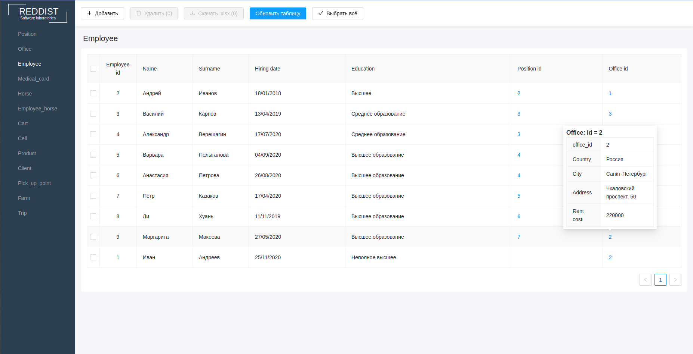

# Курсовая работа по "Информационным Системам и Базам Данных" (ИТМО, ПИиКТ, Системное и прикладное ПО, 3 курс)

## Описание
В рамках курсовой реализован интерфейс веб-админ-панели для пользователя, с возможностями:
- добавления записи;
- выбора записей и их удаления/скачивания;
- просмотра записи другой таблицы посредством тултипа над foreign key значением.